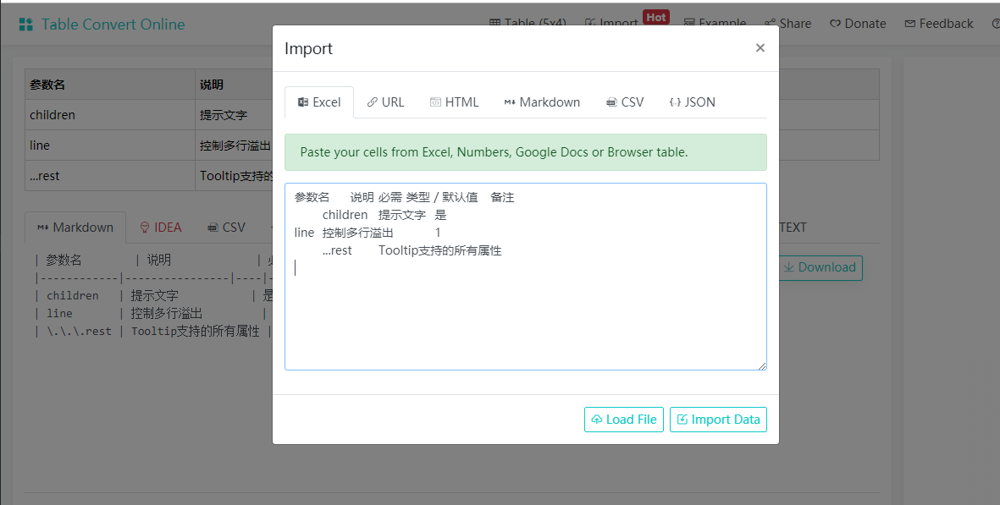

## 转换table格式
tableconvert，一个随意转换table格式的在线工具
[https://tableconvert.com/](https://tableconvert.com/)

## 富文本编辑器
[braft-editor](https://github.com/margox/braft-editor)，美观易用的React富文本编辑器，基于draft-js开发，
可以查看[使用文档](https://www.yuque.com/braft-editor/be)，也可以查看[在线演示](https://braft.margox.cn/demos/basic)，这里很贴心的提供了一些基本使用场景的演示。

## nrm
npm registry 管理工具 nrm,  能够查看和切换当前使用的registry

    $ npm install -g nrm
    $ nrm ls
    $ nrm use cnpm 

