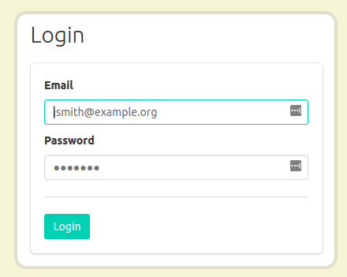
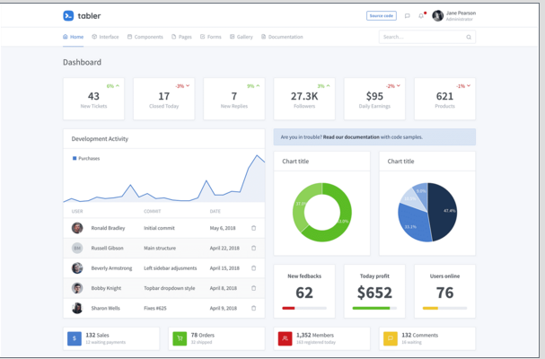

## 统一浏览器默认样式

[Reset](https://meyerweb.com/eric/tools/css/reset/)统一浏览器默认样式
```css

html, body, div, span, applet, object, iframe,
h1, h2, h3, h4, h5, h6, p, blockquote, pre,
a, abbr, acronym, address, big, cite, code,
del, dfn, em, img, ins, kbd, q, s, samp,
small, strike, strong, sub, sup, tt, var,
b, u, i, center,
dl, dt, dd, ol, ul, li,
fieldset, form, label, legend,
table, caption, tbody, tfoot, thead, tr, th, td,
article, aside, canvas, details, embed, 
figure, figcaption, footer, header, hgroup, 
menu, nav, output, ruby, section, summary,
time, mark, audio, video {
	margin: 0;
	padding: 0;
	border: 0;
	font-size: 100%;
	font: inherit;
	vertical-align: baseline;
}
/* HTML5 display-role reset for older browsers */
article, aside, details, figcaption, figure, 
footer, header, hgroup, menu, nav, section {
	display: block;
}
body {
	line-height: 1;
}
ol, ul {
	list-style: none;
}
blockquote, q {
	quotes: none;
}
blockquote:before, blockquote:after,
q:before, q:after {
	content: '';
	content: none;
}
table {
	border-collapse: collapse;
	border-spacing: 0;
}
```
## 垂直居中

### 方法一：绝对定位居中

```css
.container {
  position: relative;
}
.child {
  margin: auto;
  position: absolute;
  top: 0; left: 0; bottom: 0; right: 0;
}
```

<b>优点：</b>

1.支持跨浏览器，包括IE8-IE10.

2.无需其他特殊标记，CSS代码量少

3.支持百分比%属性值和min-/max-属性

4.只用这一个类可实现任何内容块居中

5.不论是否设置padding都可居中（在不使用box-sizing属性的前提下）

6.内容块可以被重绘。

7.完美支持图片居中。

<b>缺点：</b>

1.必须声明高度。

2.建议设置overflow:auto来防止内容越界溢出。

3.在Windows Phone设备上不起作用。

浏览器兼容性：

Chrome,Firefox, Safari, Mobile Safari, IE8-10.

<b>应用：</b>

1. 容器内
```css
  .container{
    position: relative;
    width: 500px;
    height: 200px;
    border: 1px solid #eee;
    background: #EFEFEF;
  }

  .child {
    width: 80%;
    height: 50%;
    overflow: auto;
    margin: auto;
    position: absolute;
    top: 0; left: 0; bottom: 0; right: 0;
    background: #FFF;
  }
```

 2. 内容块在浏览器可视区域内

```css
  .child.is-Fixed {
      position: fixed;
      z-index: 999;
  }
```

<!-- [http://blog.csdn.net/freshlover/article/details/11579669](http://blog.csdn.net/freshlover/article/details/11579669) -->

#### LiveStyle
  前端实时可视化工具,chrome网上商店  +liveStyle --sublime
文件和debug双向修改代码，css  less

#### 隐藏滚动条 overscroll-behavior

[https://www.w3cplus.com/css/overscroll-behavior.html](https://www.w3cplus.com/css/overscroll-behavior.html)


#### 打印
[https://lon.im/post/css-print.html](https://lon.im/post/css-print.html)

#### 动画
[HTML5+CSS3 loading 效果收集](https://www.qianduan.net/free-html5-css3-loaders-preloaders/)

[巧用 CSS 动画实现动态气泡背景](https://juejin.im/post/5a903b706fb9a06336116935)

#### CSS Houdini
[https://juejin.im/post/5adc091b51882567105f5586](https://juejin.im/post/5adc091b51882567105f5586)

Chrome 65支持,CSS Houdini只能工作在localhost域名或者是https的环境，否则的话相关API是不可见（undefined）的。如果没有https环境的话，可以装一个http-server的npm包，然后在本地启动，访问localhost:8080就可以了


#### polished.js---CSS in JS 库

[http://www.ruanyifeng.com/blog/2017/04/css_in_js.html](http://www.ruanyifeng.com/blog/2017/04/css_in_js.html)

它将一些常用的 CSS 属性封装成函数，用起来非常方便，充分体现使用 JavaScript 语言写 CSS 的优势。

#### CSS框架
Bulma框架
[http://www.ruanyifeng.com/blog/2017/10/bulma.html](http://www.ruanyifeng.com/blog/2017/10/bulma.html)

最大的特点，就是简单好用。所有样式都基于class，只需为 HTML 元素指定class，样式立刻生效。



tabler [https://github.com/tabler/tabler](https://github.com/tabler/tabler)

一套基于 Bootstrap 4 免费开源的 Dashboard 模版




## 5 种常见 flex 布局

[https://juejin.im/post/5a1d0198f265da43052e5c52](https://juejin.im/post/5a1d0198f265da43052e5c52)
```html
<!-- 经典的上-中-下布局 -->
<body>
  	<header>HEADER</header>
  	<article>CONTENT</article>
  	<footer>FOOTER</footer>
</body>
body {  min-height: 100vh;  display: flex;  flex-direction: column;}
article {  flex: auto;}
```
```html
<!-- 上-中-下 header不滚动 -->
<body>
  <header>HEADER</header>
  <article>CONTENT</article>
  <footer>FOOTER</footer>
</body>
body { min-height: 100vh; display: flex; flex-direction: column; padding-top: 60px; }
header { height: 60px; position: fixed; top: 0; left: 0; right: 0; padding: 0; }
article { flex: auto; height: 1000px; }
```

```html
<!-- 中左宽固定 -->
<body>
  <header>HEADER</header>
  <div class="content">
    <aside>ASIDE</aside>
 	  <article>CONTENT</article>
  </div>
  <footer>FOOTER</footer>
</body>
body { min-height: 100vh; display: flex; flex-direction: column; }
 .content { flex: auto; display: flex; }
.content article { flex: auto; }
```
```html
<body>
  <aside>ASIDE</aside>
  <div class="content">
    <header>HEADER</header>
 	  <article>CONTENT</article>
    <footer>FOOTER</footer>
 	</div>
</body>
body { min-height: 100vh; display: flex; }
aside { flex: none; }
.content { flex: auto; display: flex; flex-direction: column; }
.content article { flex: auto; }
```

```html
<!-- 左滚动  左侧为菜单 -->
<body>
  <aside> ASIDE
    <p>item</p>
    <p>item</p>
    <p>item</p>
 </aside>
 <div class="content">
    <header>HEADER</header>
    <article>CONTENT</article>
    <footer>FOOTER</footer>
  </div>
</body>
body { height: 100vh; display: flex; }
aside { flex: none; width: 200px; overflow-y: auto; display: block; } .content { flex: auto; display: flex; flex-direction: column; overflow-y: auto; }
.content article { flex: auto; }
```


