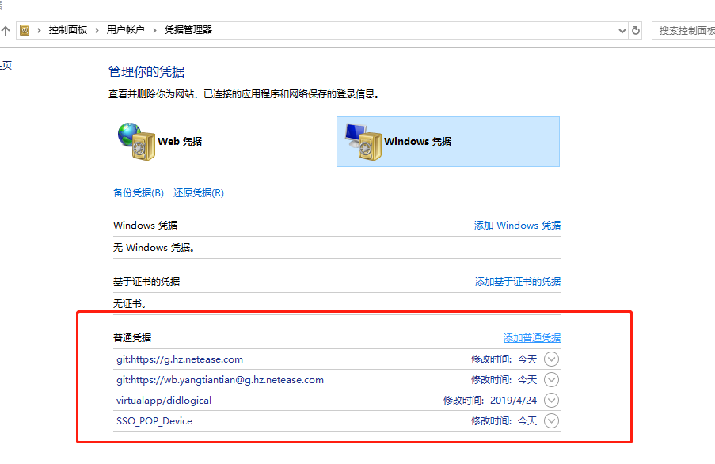

## Git

## git修改密码

修改git 已配置的用户密码

控制面板---用户账户---凭据管理--修改相应的密码

运行一下命令缓存输入的用户名和密码：

    git config --global credential.helper wincred

清除掉缓存在git中的用户名和密码

    git credential-manager uninstall

恢复保存密码

    git config --global credential.helper store