# nvm-Windows
nvm-windows，用于Windows下的node版本管理。

## 卸载原先安装的nodejs

1. 控制面板-程序卸载-node-右键卸载
2. 从下列的目录中找到相关的内容并删除掉：

    C:\Program Files (x86)\nodejs

    C:\Program Files\nodejs

    C:\Users\{User}\AppData\Roaming\npm（或%appdata%\npm）

    C:\Users\{User}\AppData\Roaming\npm-cache（或%appdata%\npm-cache）

3. 检查%PATH%环境变量以确保没有引用Nodejs或npm存在。

4. 重新启动电脑。

## 下载安装
 官网地址[https://github.com/coreybutler/nvm-windows/releases](https://github.com/coreybutler/nvm-windows/releases) 下载nvm-set.zip压缩包，本次下载为1.1.7版本。

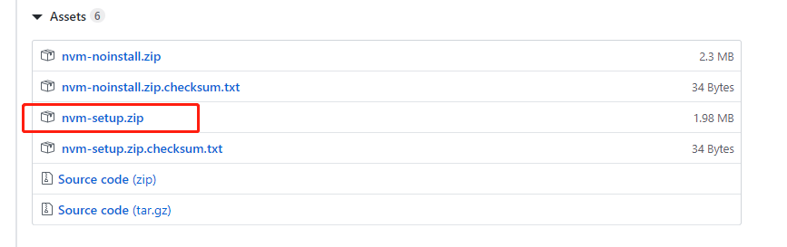

双击nvm-setup.exe 进行安装：

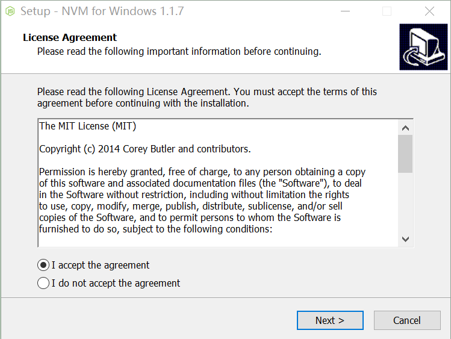
注意：nvm的安装目录

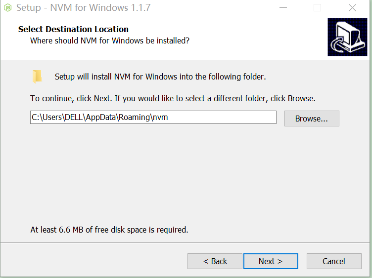

注意：nodejs的安装目录，文件名不要有空格和中文！

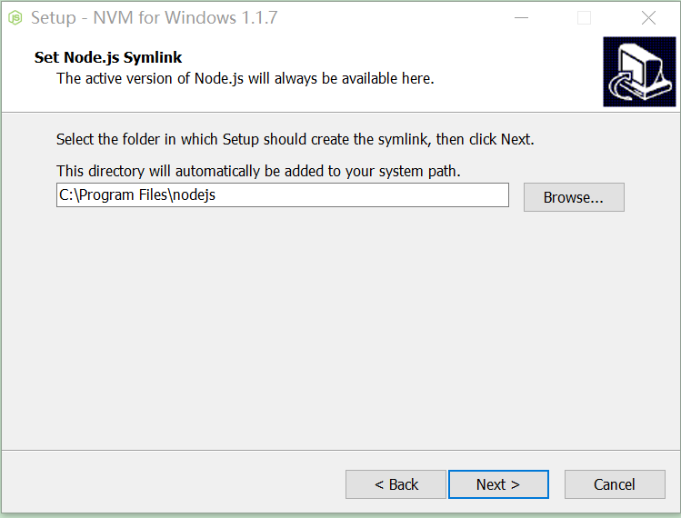

点击install 下载依赖

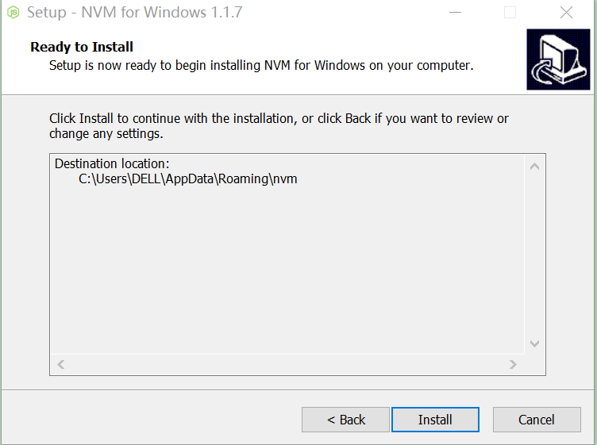

## 检查环境变量
1.1.7版本安装完成后会自动设置环境变量，但是建议检查一下

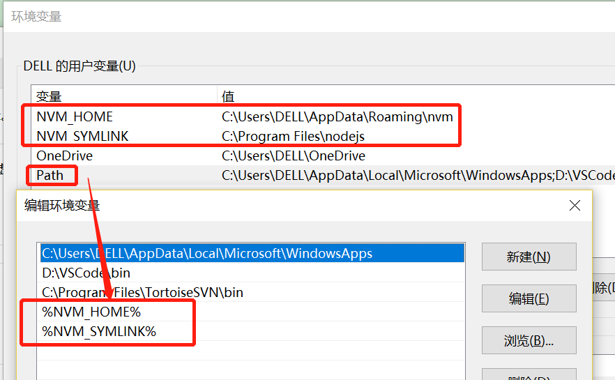

    NVM_HOME   C:\Users\DELL\AppData\Roaming\nvm
    NVM_SYMLINK   C:\Program Files\nodejs
    %NVM_HOME%
    %NVM_SYMLINK%

## nvm下载使用node
常用命令

    nvm -v                      // 查看版本
    nvm install 6.15.1 64-bit  // 下载某个版本的node
    nvm install 10.7.0
    nvm ls                     // 查看所有已下载版本
    nvm use 10.7.0             // 使用某个版本的node
    nvm ls
    nvm uninstall 10.7.0       // 删除

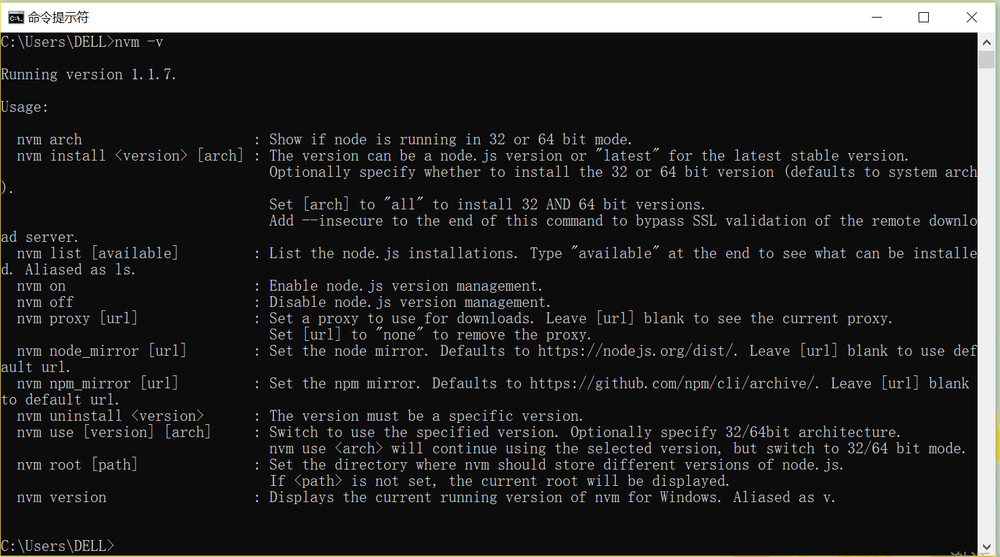

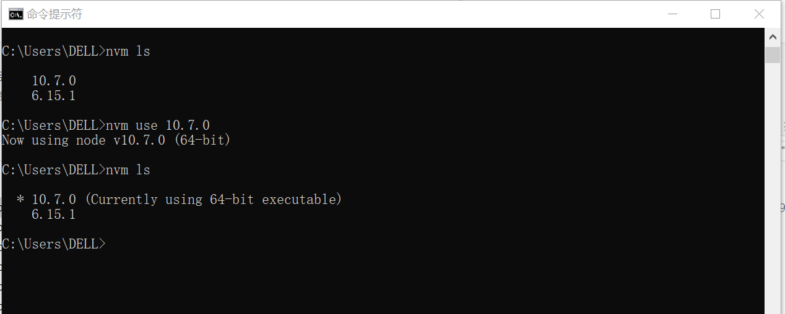
正在使用的版本会标星号

## 很重要的温馨提示
当执行 nvm install xxx  下载完成某一个版本node之后，在nvm的安装目录即可找到以版本号命名的文件夹，
打开文件夹，必须包含npm 的相关文件和node_modules，且node_modules里面包含npm依赖包，否则下载的该版本不可用！
亲测不是所有版本都会顺利下载npm包,
低版本和高版本包含的npm文件会略有不同。
如下：

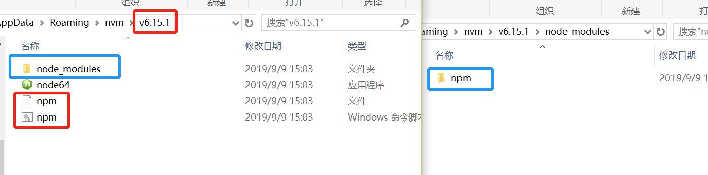

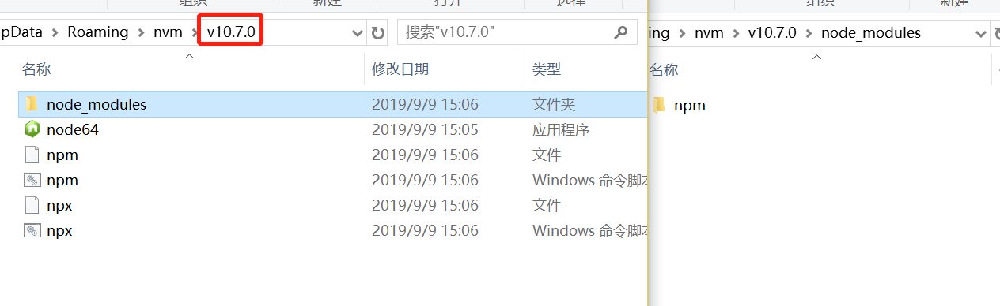

## 有帮助的tips 

::: tip nodejs
安装完成后C:\Users\DELL\AppData\Roaming\nvm 可以找到，但是C:\Program Files\nodejs 没找到，
当下载过一个node版本后会出现在安装时选择的目录里，当使用nvm use xxx命令切换node版本时nodejs文件内的node和npm的版本也会发生相应变化。

没有使用nvm之前安装的nodejs默认也会安装在该目录下，也许这是一开始需要删除原来安装过node的原因。
::: 

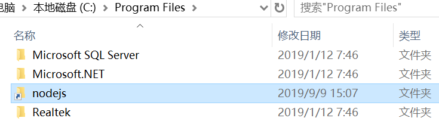

::: tip 可下载成功的版本

    6.15.1
    7.0.0
    8.0.0
    10.0.0
    10.7.0

注意：列出来的也不保证也可下载成功，反之也成立。
::: 
    
::: tip 使用别人下载成功的压缩包
别人下载成功的相应版本的压缩包，直接压缩文件夹，解压到自己的安装目录即可。

注意解压时的文件目录，例如解压到nvm/v6.15.1 而不是 nvm/v6.15.1 /v6.15.1 
::: 

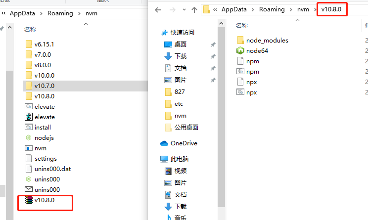
