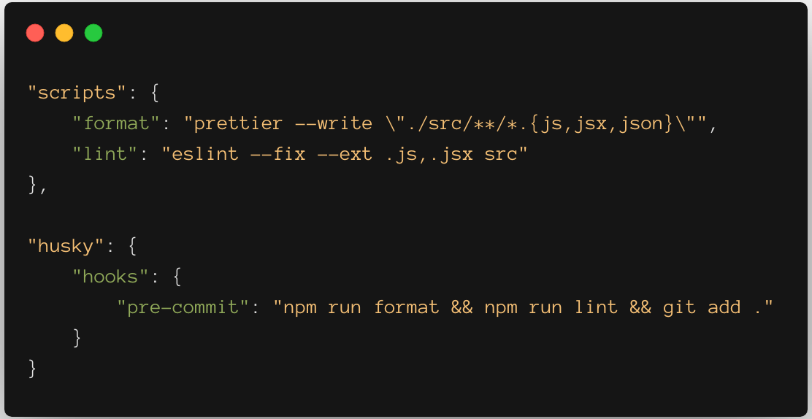

## Git分支命名
* master：主分支

  * 负责记录线上版本的迭代
  * 该分支代码与线上代码是完全一致的

* develop：开发分支

  * 负责目前最新开发进度的版本

* feature/*：功能分支

  * 用于开发新的功能
  * 基于develop分支检出
  * 开发完成并自测通过后，需要合并到develop分支，随后删除

* release：发布分支

  * 用于代码上线准备，创建后由测试同学发布到测试环境进行测试
  * 基于develop分支检出
  * 提测过程中，发现bug，则在release分支进行修复；
  * 上线前，需将release分支合并到master、develop分支

* hotfix：紧急修复分支

  * 用于线上bug的修复
  * 基于master分支检出
  * 修复完后，合并到master、develop分支

* refactor：代码优化分支

  * 用于代码的优化（一般在提测之后），优化在开发阶段产生的冗余或不完善的代码
  * 基于release分支检出
  * 优化完后，合并到release分支

## Commit格式

格式：type: message

* type（7 种提交类型）
  * feature: 新特性
  * refactor: 代码重构 && 优化
  * style: 样式修改
  * fix: bug修复（提测阶段 && 紧急线上）
  * debugger: 联调过程中解决的问题
  * docs: 文档修改（文案修改 && 文件更新）
  * build: npm run build 打包

### Huskey

Commit校验工具，在 git commit 提交代码前，利用 Git钩子——pre-commit 来实现代码规范检测。一旦发现检测结果带有 error，则不允许提交到远程仓库。

安装 : yarn add husky -D

package.json配置

