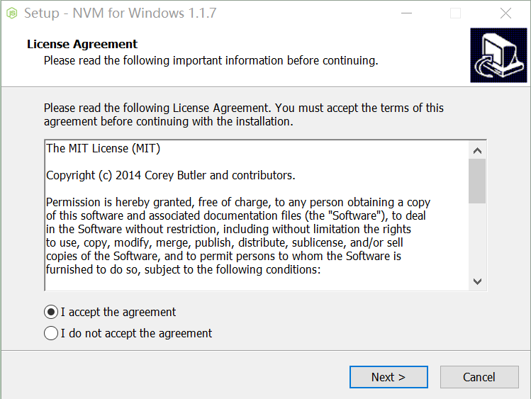
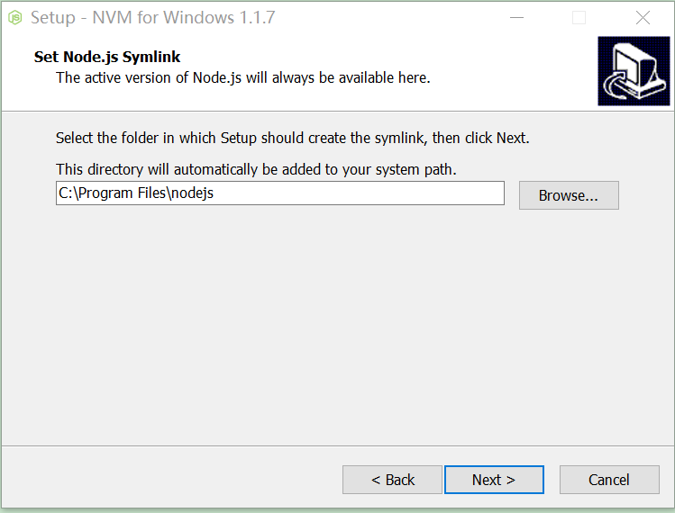
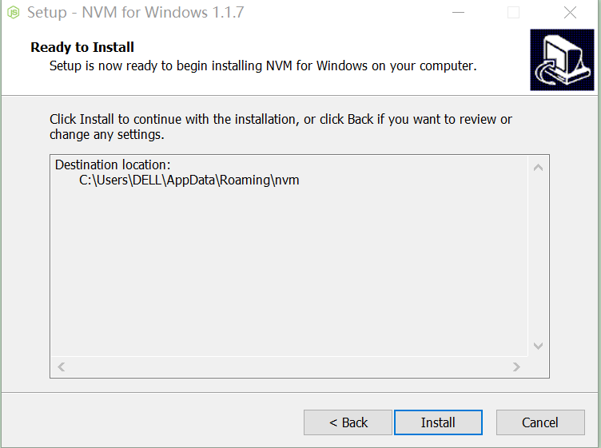
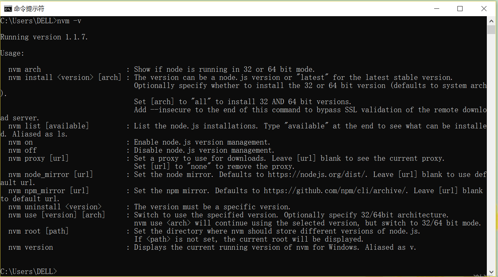
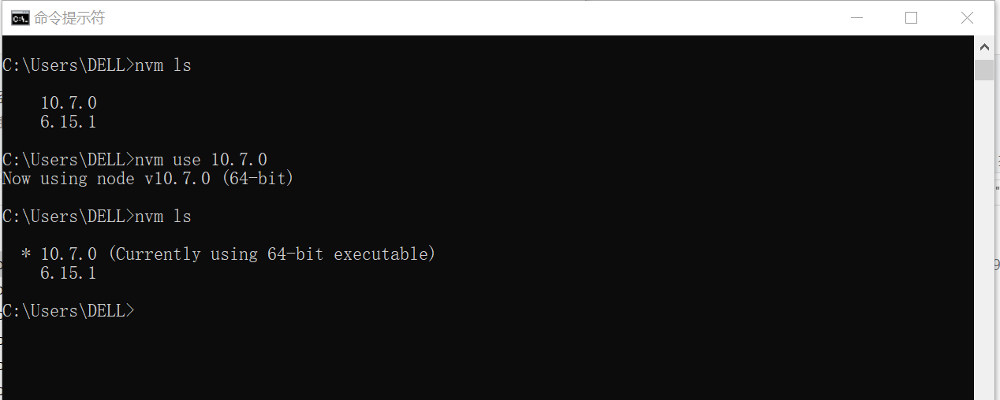
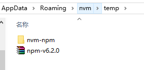
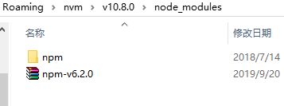
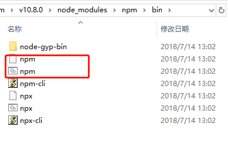

# nvm-Windows
nvm-windows，用于Windows下的node版本管理。
## step1：卸载原先安装的nodejs

1. 控制面板-程序卸载-node-右键卸载
2. 从下列的目录中找到相关的内容并删除掉：

    C:\Program Files (x86)\nodejs

    C:\Program Files\nodejs

    C:\Users\{User}\AppData\Roaming\npm（或%appdata%\npm）

    C:\Users\{User}\AppData\Roaming\npm-cache（或%appdata%\npm-cache）

3. 检查%PATH%环境变量以确保没有引用Nodejs或npm存在。

4. 重新启动电脑。

## step2：下载安装
 官网地址 [https://github.com/coreybutler/nvm-windows/releases](https://github.com/coreybutler/nvm-windows/releases) 下载nvm-set.zip压缩包，本次下载为1.1.7版本。

双击nvm-setup.exe 进行安装：

注意：nvm的安装目录

注意：nodejs的安装目录，文件名不要有空格和中文！

点击install 下载依赖

## step3：检查环境变量
1.1.7 版本安装完成后会自动设置环境变量，但是建议检查一下

    NVM_HOME   C:\Users\DELL\AppData\Roaming\nvm
    NVM_SYMLINK   C:\Program Files\nodejs
    %NVM_HOME%
    %NVM_SYMLINK%

## step4：nvm下载并使用node
设置镜像

    nvm node_mirror https://npm.taobao.org/mirrors/node/
    nvm npm_mirror https://npm.taobao.org/mirrors/npm/

常用命令

    nvm -v                      // 查看版本
    nvm install 6.15.1 64-bit  // 下载某个版本的node
    nvm install 10.7.0
    nvm ls                     // 查看所有已下载版本
    nvm use 10.7.0             // 使用某个版本的node
    nvm ls
    nvm uninstall 10.7.0       // 删除

<b>ps: 正在使用的版本会标星号</b>

### 为什么要删除 C:\Program Files\nodejs ？？？

没有使用 nvm 之前安装的 nodejs 默认会安装在 C:\Program Files\nodejs，使用 nvm 下载 node 版本时也会在C:\Program Files\ 生成一个动态变化的 nodejs 文件夹（如下图所示带箭头），使用 nvm use xxx 命令切换 node 版本时 nodejs 文件内的 node 包和 npm 包的版本也会发生相应变化。  
所以开始安装nvm之前需要删除原来安装过的node。

## 踩坑预警
当执行 nvm install xxx  下载完成某一个版本node之后，在nvm的安装目录即可找到以版本号命名的文件夹，
打开文件夹，必须包含npm 的相关文件和node_modules，且node_modules里面包含npm依赖包，否则下载的该版本不可用！
亲测不是所有版本都会顺利下载npm包,
低版本和高版本包含的npm文件会有不同。
如下：

### Node 下载成功，npm 包下载不成功 ？？？

<b>方法1： 根目录下 settings.txt 添加镜像</b>

    root: D:\nvm
    path: D:\nvm\nodejs
    node_mirror: https://npm.taobao.org/mirrors/node/
    npm_mirror: https://npm.taobao.org/mirrors/npm/

<b>方法2：使用别人下载成功的压缩包</b>

别人下载成功的相应版本的压缩包，直接压缩文件夹，解压到自己的安装目录即可。  
注意解压时的文件目录，例如解压到 nvm/v6.15.1 而不是 nvm/v6.15.1/v6.15.1 

<b>方法3：神操作</b>

cmd 执行 nvm install 10.8.0 后 nvm 根目录文件夹下会暂时出现一个 temp 文件夹，
迅雷不及掩耳之势赶紧复制压缩包，(注意) cmd 进程下载完成后，粘贴到 v10.8.0/node-modules 下，解压，改名 npm，删包，搞定！

如果 v10.8.0/ 根文件夹下没有 npm 文件和 npm 进程文件，将 v10.8.0\node_modules\npm\bin 中的 npm 文件复制一份出来即可。

