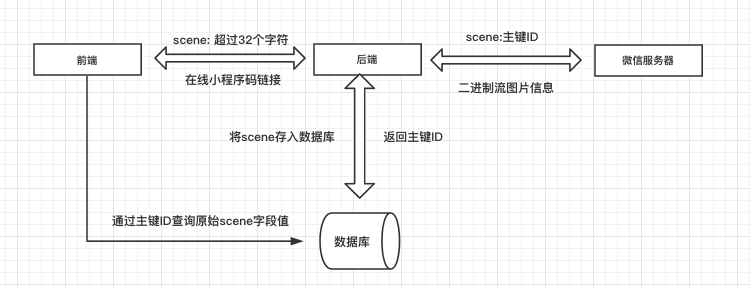

## 基础

<b>必读文档：</b> [微信官方文档](https://developers.weixin.qq.com/miniprogram/dev/framework/quickstart/)
[运营规范](https://developers.weixin.qq.com/miniprogram/product/#%E4%B8%80%E3%80%81%E5%8E%9F%E5%88%99%E5%8F%8A%E7%9B%B8%E5%85%B3%E8%AF%B4%E6%98%8E)

<b>AppID：</b>小程序唯一凭证，可在「微信公众平台 - 开发 - 开发设置」页中获得。

<b>AppSecret：</b> 小程序密钥，可在「微信公众平台 - 开发 - 开发设置」页中手动生成。

<b>数据请求：</b>采用 wx.request 方法，需要事先设置通讯服务器域名。

<b>服务器域名配置：</b>「微信公众平台-开发-开发设置-服务器域名」 中进行配置，配置前认真阅读 [配置注意事项](https://developers.weixin.qq.com/miniprogram/dev/framework/ability/network.html)，遇到未知错误可查看 [小程序服务器域名配置常见错误及解决方法](https://kf.qq.com/faq/1706236NjINj1706236VRZBR.html)。

<b>框架：</b>推荐 [Taro](https://nervjs.github.io/taro/docs/README.html) + [Taro-UI](https://taro-ui.jd.com/#/docs/introduction)，由京东凹凸实验室开发，遵循 React 语法规范的多端开发解决方案，适用于微信/百度/支付宝/字节跳动/QQ/京东小程序、快应用、H5、React-Native 等。

## 零散且重要的知识点
- 限制
    - DOM节点不超过16000个
    - 代码编译后大小不超过2M，图片素材最好上传cdn
- 本地存储
    - 隔离策略
        - 同一个微信用户，同一个小程序 storage 上限为 10MB。storage 以用户维度隔离，同一台设备上，A 用户无法读取到 B 用户的数据；不同小程序之间也无法互相读写数据。

    - 清理策略
        - 本地缓存的清理时机跟代码包一样，只有在代码包被清理的时候本地缓存才会被清理。

## 小程序码

 #### 1、三种生成方式
wxacode.get：获取小程序码，适用于需要的码数量较少的业务场景。通过该接口生成的小程序码，永久有效，有数量限制

wxacode.createQRCode：获取小程序二维码，适用于需要的码数量较少的业务场景。通过该接口生成的小程序码，永久有效，有数量限制

wxacode.getUnlimited：获取小程序码，适用于需要的码数量极多的业务场景。通过该接口生成的小程序码，永久有效，数量暂无限制

[获取小程序码--官方文档](https://developers.weixin.qq.com/miniprogram/dev/api-backend/open-api/qr-code/wxacode.createQRCode.html)

 #### 2、获取接口凭证，生成小程序码

[auth.getAccessToken](https://developers.weixin.qq.com/miniprogram/dev/api-backend/open-api/access-token/auth.getAccessToken.html)，获取小程序全局唯一后台接口调用凭据（access_token）。调用绝大多数后台接口时都需使用 access_token，开发者需要进行妥善保存。拿到凭证后再调用获取小程序码的接口。

* auth.getAccessToken请求地址域名为api.weixin.qq.com，微信公众平台出于安全考虑无法配置api.weixin.qq.com域名，所以获取小程序码交给后端解决。

#### 3、参数超长的解决方案

实际业务场景中，小程序码会携带很多参数信息，但是scene参数有长度限制不能超过32个可见字符。

#### 4、小程序未发布上线前无法扫描识别小程序码

小程序未发布上线前，是不能通过微信扫码识别小程序码的，两种方式模拟测试：

* 使用本地模拟测试：工具--普通编译--通过二维码编译
* 调用 wx.scanCode 调起客户端扫码界面，选择图片进行扫码

## 打包过大

*  小图片(几k-几10k的)，不是很多的，可以放在小程序里
*  大图片统一用网络地址
*  类库js最好用min版的
*  相同的逻辑代码，提取出来做成公共代码
*  需要npm安装的第三方类库，建议用云函数
*  使用分包，将一些功能放到分包中，首页就留一些首页数据展示等的功能就行，比如说登录相关的可以做成一个分包，[官网文档](https://developers.weixin.qq.com/miniprogram/dev/framework/subpackages/basic.html)