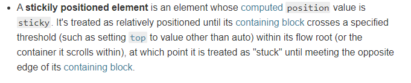
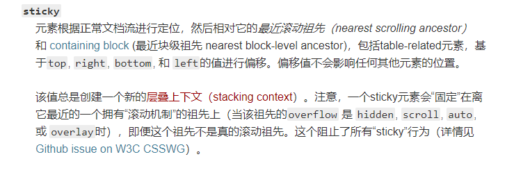

# 微信小程序开发须知

## 插槽slot
自定义组件时slot你不管放在什么位置，渲染时就是都是直接追加在你自定义内容的后面，而且放的位置不一样，虽然都是追加在后面，但是有些样式不生效，布局乱掉，位置乱掉。

[围观踩坑 go >>](/wechat/taro.html#插槽slot)

## 自定义底部导航栏
自定义tabbar时，page不会像原来那样高度只到tabbar之上，page区域会拉升到屏幕最底部，tabbar会覆盖一部分的内容。

[围观踩坑 go >>](/wechat/taro.html#自定义tabbar)

## 自定义顶部导航栏
* 没有官方方案，只能自己使用cover-view来自定义
* 胶囊按钮不同手机的位置不一样和单位转换无关，通过 wx.getMenuButtonBoundingClientRect() 可获取坐标位置，坐标信息以屏幕左上角为原点
* 自定义navbar 和 tabbar一样会使page拉伸到顶部，页面内部会被navbar 遮挡，你可能会想到给页面顶部添加padding-top，但是当你需要下拉刷新的时候，由于下拉刷新是从page的顶部开始的，你的下拉还是会挡住，而设置margin 也不可取，下拉刷新就是用的margin，冲突的。

[围观踩坑 go >>](/wechat/taro.html#自定义顶部导航)

## 限制

* DOM节点不超过16000个
* 代码编译后大小不超过2M，图片素材最好上传cdn

## 分享卡片尺寸
 只要是 5:4 就能正常显示。推荐尺寸：标清 375 * 300，高清 750 * 600

## 打包过大

* 小图片(几k-几10k的)，不是很多的，可以放在小程序里
*  大图片统一用网络地址
*  类库js最好用min版的
*  相同的逻辑代码，提取出来做成公共代码
*  需要npm安装的第三方类库，建议用云函数
*  使用分包，将一些功能放到分包中，首页就留一些首页数据展示等的功能就行，比如说登录相关的可以做成一个分包，官网文档：https://developers.weixin.qq.com/miniprogram/dev/framework/subpackages/basic.html

## pages

```js

{
  "pages": ["pages/index/index", "pages/logs/logs"]
}

```
pages不能单独抽出到一个文件，以下方法不行：

```js
// pages.js
 export const pagesList = ["pages/index/index", "pages/logs/logs"]

 // app.js

 import {pagesList} from './pages.js'

 {
  "pages": pagesList
}
```
## scroll-view 标签

scroll-view 标签对 dispay:flex 无效
```
<scroll-view
    scroll-x="true"
    class="scroll-view-demo"
>
    <view class="item" wx:for="{{[1,2,3,4,5,6,7,8,9,10,11,12,13,14]}}" wx:key="{{index}}">
        {{item}}
    </view>
</scroll-view>

```

```scss

page {
  width: 100%;
  height: 100%;
  background: #17448E;
}
.scroll-view-demo {
  display: flex;
  flex-direction: row;
  .item {
    width: 80rpx;
    height: 80rpx;
    border: solid 1px #fff;
    display: flex;
    color: #fff;
    font-size: 36rpx;
    justify-content: center;
    align-items: center;
    border-radius: 40rpx;
    margin-left: 50rpx;
  }
}
```
凉凉~~~

解决：
```scss
.item {
  display: inline-block;
}
```

## 粘性布局 position:sticky

先看MDN文档：




看完一脸懵逼的，你不是一个人，多看几遍就好了......

还是上代码吧：

<StickyOne/>


总结：   
* 父元素不能 overflow:hidden、scroll、auto、overlay 属性。
* 父元素的高度不能低于sticky元素的高度
* 父级元素不要设置固定高度（* 效果见上图）
* 必须指定top、bottom、left、right4个值之一，否则只会处于相对定位 （不得不说的废话）

小程序开发时你需要注意：

1. 小程序的page 默认设置了 overflow-x:hidden
```jsx
// error
<page>
  <View className="search-btns"></View>
</page>

// true：
<page>
  <View><View className="search-btns"></View></View>
</page>

```

2. 移动端开发有时会为了空元素占位，写height:100vh，需换成min-height:100vh

例如一个职位列表页：

```jsx

  <View className="demo">
    <View className="banner"></View>
    <View className="search-btns">搜索定位</View>
    <View className="list">职位列表</View>
    <View className="no-data">暂无数据</View>
  </View>

```

当给demo设置height:100vh时，滚动距离大于100vh，sticky元素也会跟着滚走，效果见上图