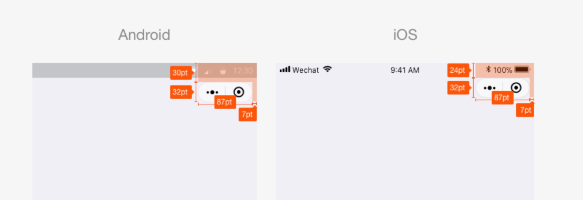
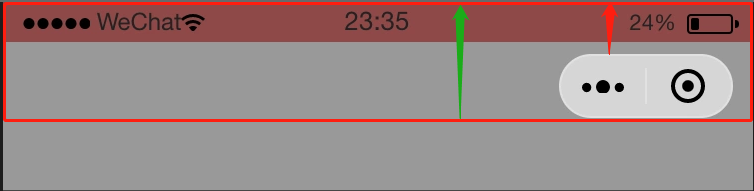

## 自定义底部导航栏

- 使用原生导航栏会有以下问题：

    - app.jsx内作以下配置后，只有首页，职位页会显示tabBar，其他页面无法显示tabBar
    - 首页想跳转到职位页，只能使用 wx.switchTab，但是URL路径后不能带参数

- 注意：自定义tabbar时，page不会像原来那样高度只到tabbar之上，page区域会拉升到屏幕最底部，tabbar会覆盖一部分的内容。


```js
"tabBar": {
    "list": [
      {
        "pagePath": "pages/index/index",
        "text": "首页"
      },
      {
        "pagePath": "pages/jobs/logs",
        "text": "职位"
      }
    ]
  },
```

封装组件: [Taro](https://nervjs.github.io/taro/docs/README.html) + [Taro-UI](https://taro-ui.jd.com/#/docs/introduction)
```jsx
// Tabber.jsx
import Taro, { useState } from '@tarojs/taro'
import { AtTabBar } from 'taro-ui'
import { getGlobalData } from '@/utils/global'

const isIphoneX = getGlobalData('isIphoneX')

const tabList= [
        { 
          title: '首页', 
          iconPrefixClass: 'icon', 
          iconType: 'shouye', 
          selectedIconType: 'shouye1' 
        },
        { 
          title: '热招职位', 
          iconPrefixClass: 'icon', 
          iconType: 'rezhaozhiwei', 
          selectedIconType: 'rezhaozhiwei1' 
        }
      ]
export default function Tabber(props) {
  const [current, setCurrent] = useState(props.current || 0)
  
  const handleClick = val => {
    setCurrent(val)
    switch (val) {
      case 0:
        Taro.redirectTo({ url: `/pages/index/index` })
        break
      case 1:
        Taro.redirectTo({ url: `/pages/jobs/index` })
        break
      default:
        break
    }
  }

  return (
    <View className="net-tab-bar">
      <View className="placeholder"></View>
      <AtTabBar
        className={isIphoneX ? 'is-phonex' : ''}
        fixed
        tabList={tabList}
        fontSize={12}
        iconSize={18}
        onClick={handleClick}
        current={current}
      />
    </View>
  )
}
```

```scss
$tabBarHeight:120px;
// tabber.scss
.net-tab-bar {
    .placeholder {
        height: $tabBarHeight;
    }
    
}

// global.scss
.at-tab-bar {
    height: $tabBarHeight;

    &.is-phonex {
        padding-bottom: $iphoneXFoot !important;
        background: #FFF !important;
    }
}
```


## 自定义顶部导航栏

  - 调皮的胶囊按钮：
    - 导航栏元素（文字，图标等）怎么也对不齐那该死的胶囊按钮
    - 不同手机的位置不一样和单位转换无关，通过 wx.getMenuButtonBoundingClientRect() 可获取坐标位置，坐标信息以屏幕左上角为原点
  - 机型多如牛毛：
    - 自定义导航栏高度在不同机型始终无法达到视觉上的统一，各种尺寸的全面屏，奇怪的刘海屏，简直要抓狂
  - 下拉刷新问题：
    - 自定义navbar 和 tabbar一样会使page拉伸到顶部，页面内部会被navbar 遮挡，由于下拉刷新是从page的顶部开始的，设置padding-top或margin 都不可取。


<b>归根结底，最重要的一点是计算导航栏的高度。</b>

先扒一波官方文档：



从图中分析，我们可以得到如下信息：

 - Android跟iOS有差异，表现在顶部到胶囊按钮之间的距离差了6pt
 - 胶囊按钮高度为32pt， iOS和Android一致

wait......这仅仅是普通屏幕为参照的，好像并没有提适配的事儿，难道都是一样的？？？    impossible !!!

微信有个可以获取机器信息的接口 [wx.getSystemInfoSync](https://developers.weixin.qq.com/miniprogram/dev/api/base/system/system-info/wx.getSystemInfoSync.html)，
在 <b>默认导航栏 & 无底部tab栏 </b>的情况下，可以看到三项信息:
 - screenHeight 屏幕高度，单位px
 - windowHeight 可使用窗口高度，单位px
 - statusBarHeight 状态栏的高度，单位px

screenHeight - windowHeight就是默认的导航栏的高度（绿色箭头），statusBarHeight 是状态栏的高度（红色箭头）



但是在设置了"navigationStyle": "custom"之后，screenHeight、 windowHeight二者的值是一样的了，因此导航栏的高度我们需要使用统计的经验值。

```js
{
    'iPhone': 64,
    'iPhoneX': 88,
    'Android': 68,
    'samsung': 72
}
```
<b>方案一：</b>

- 根据上面罗列的机型设置经验值 navHeight
- 获取statusBarHeight

<b>方案二：  </b>  

- Android导航栏高度 =  48px ; iOS导航栏高度 =  44px (多一步计算后你会发现)
- 获取statusBarHeight

:::tip 总结

- 自定义导航组件，结构一分为二：状态栏 + 标题栏
- 状态栏高度通过wx.getSystemInfoSync().statusBarHeight获取
- 标题栏高度：安卓：48px，iOS：44px
- 单位必需跟胶囊按钮组件一致，用px
:::

选取方案二进行开发：
```jsx
// app.jsx
import { setGlobalData } from '@/utils/global'


 componentWillMount() {
    const systemInfo = Taro.getSystemInfoSync()
      setGlobalData('systemInfo', systemInfo)
  }

```

```jsx
import Taro from '@tarojs/taro'
import { View } from '@tarojs/components'
import { AtIcon } from 'taro-ui'
import { getGlobalData } from '@/utils/global'
import './index.scss'

const NavBar = props => {
  const { back = true, home = false, title } = props
  const systemInfo = getGlobalData('systemInfo')
  const isphone = systemInfo.model.includes('iPhone')
  const statusBarHeight = systemInfo.statusBarHeight
  console.log(systemInfo)
  const navHeight = statusBarHeight + (isphone ? 44 : 48) + 'px'
  const goBack = () => {
    Taro.navigateBack({
      delta: 1
    })
  }
  const goBackHome = () => {}
  return (
    <View className="net-nav-bar">
      <View className="navbar" style={{ height: navHeight }}>
        {/- 状态栏占位块*/}
        <View style={{ height: statusBarHeight + 'PX' }}></View>

        <View className="title-container" style={{ height: navHeight }}>
          <View className="capsule">
            {back && (
              <View onClick={goBack} className="mr-20">
                <AtIcon value="chevron-left" size="26" color="#000" />
              </View>
            )}
            {home && (
              <View onClick={goBackHome}>
                <AtIcon prefixClass="icon" value="shouye" size="25" color="#000" />
              </View>
            )}
          </View>
          <View className="title">{title} </View>
        </View>
      </View>
        {/- 占位块--解决下拉刷新 */}
      <View style={{ height: navHeight, background: '#fff' }}></View>
    </View>
  )
}

export default NavBar


```

```scss
.net-nav-bar {
    background: #fff;

    .mr-20 {
        margin-right: 20px;
    }

    .navbar {
        position: fixed;
        top: 0;
        left: 0;
        z-index: 999;
        display: flex;
        flex-direction: column;
        width: 100%;
    }

    .title-container {
        position: relative;
        display: flex;
        align-items: center;
        justify-content: center;
        height: 100%;
    }

    .capsule {
        position: absolute;
        left: 10px;
        display: flex;
        align-items: center;
    }

    .title {
        font-size: 28px;
    }
}

```
::: tip 
组件内多了一个占位块，是因为某些页面有类似滚动列表或者下拉刷新的需求，要保证导航栏始终在视窗的顶部的话，需要使用定位，定位之后脱离文档流，在最初的时候需要占位块保证后续的页面内容不会被导航栏遮挡。
:::


## 转发/分享

[官方文档--转发](https://developers.weixin.qq.com/miniprogram/dev/framework/open-ability/share.html#%E4%BD%BF%E7%94%A8%E6%8C%87%E5%BC%95)

通过给 button 组件设置属性 open-type="share"，可以在用户点击按钮后触发 Page.onShareAppMessage 事件，此事件处理函数需要 return 一个 Object，用于自定义转发内容，支持参数如下：
| 字段        | 说明           | 默认值  |最低版本|
| ------------- |-------------|:-----:|:-------:|
|title	|转发标题	|当前小程序名称|
|path	|转发路径	|当前页面 path ，必须是以 / 开头的完整路径|
|imageUrl	|自定义图片路径，可以是本地文件路径、代码包文件路径或者网络图片路径。支持PNG及JPG。显示图片长宽比是 5:4。	|使用默认截图|1.5.0

Taro 同样提供了对应支持的hooks：[useShareAppMessage](https://nervjs.github.io/taro/docs/hooks.html#useshareappmessage)

注意：

- 只有定义了此事件处理函数，右上角菜单才会显示“转发”按钮
- 不自定义转发图片的情况下，默认会取当前页面，从顶部开始，高度为 80% 屏幕宽度的图像作为转发图片
- 分享卡片图片长宽比是 5:4

## 消息订阅

<b>应用场景：作为服务进度提醒和召回用户</b>

[小程序订阅消息](https://developers.weixin.qq.com/miniprogram/dev/framework/open-ability/subscribe-message.html)的特点：
- 订阅消息推送位置：服务通知
- 订阅消息下发条件：用户自主订阅
- 订阅消息卡片跳转能力：点击查看详情可跳转至该小程序的页面
- 取消了【消息模板】7天内推送消息的限制，推送时间更加灵活并且能够契合多样化的服务需求。

开发步骤简单：

1. 获取模板 ID    
    登录 [微信公众平台](https://mp.weixin.qq.com )手动配置获取模板ID，如果没有合适的模板，可以申请添加新模板，审核通过后可使用。
2. 获取下发权限    
在页面内调用接口 [wx.requestSubscribeMessage](https://developers.weixin.qq.com/miniprogram/dev/api/open-api/subscribe-message/wx.requestSubscribeMessage.html)，调起客户端小程序订阅消息界面，用户手动确认订阅消息。
3. 服务端调用接口 [subscribeMessage.send](https://developers.weixin.qq.com/miniprogram/dev/api-backend/open-api/subscribe-message/subscribeMessage.send.html)下发订阅消息  


### 小踩坑

1. 一次性订阅消息 和 长期性订阅消息


- 一次性订阅消息
    - 用户订阅一次后，开发者可下发一条消息，不限时间。若用户勾选了“总是保持以上选择，不再询问”且点击了允许，那么以后都默认同意订阅这条消息。
- 长期性订阅消息
    - 用户订阅一次后，可长期下发多条消息。目前长期性订阅消息向政务、医疗、交通、金融、教育等线下公共服务开放，普通的小程序不开发。

2. 不支持开发者工具，只能通过真机调试

## 消息推送
<b>应用场景：客服会话</b>   

当小程序内使用了[客服消息](https://developers.weixin.qq.com/miniprogram/dev/framework/open-ability/customer-message/customer-message.html)时，用户操作（如用户向小程序客服发送消息、或者进入会话等情况）会引发事件推送，【微信服务器】 会将消息（或事件）的数据包以 POST 请求发送到开发者配置的 【消息推送接收服务器】 ，开发者在 服务端 可以依据自身业务逻辑进行响应，详情查看[官方文档](https://developers.weixin.qq.com/miniprogram/dev/framework/server-ability/message-push.html)。

