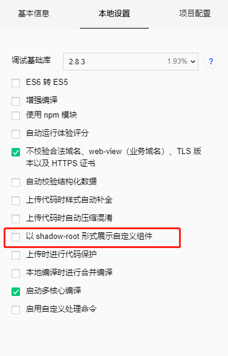
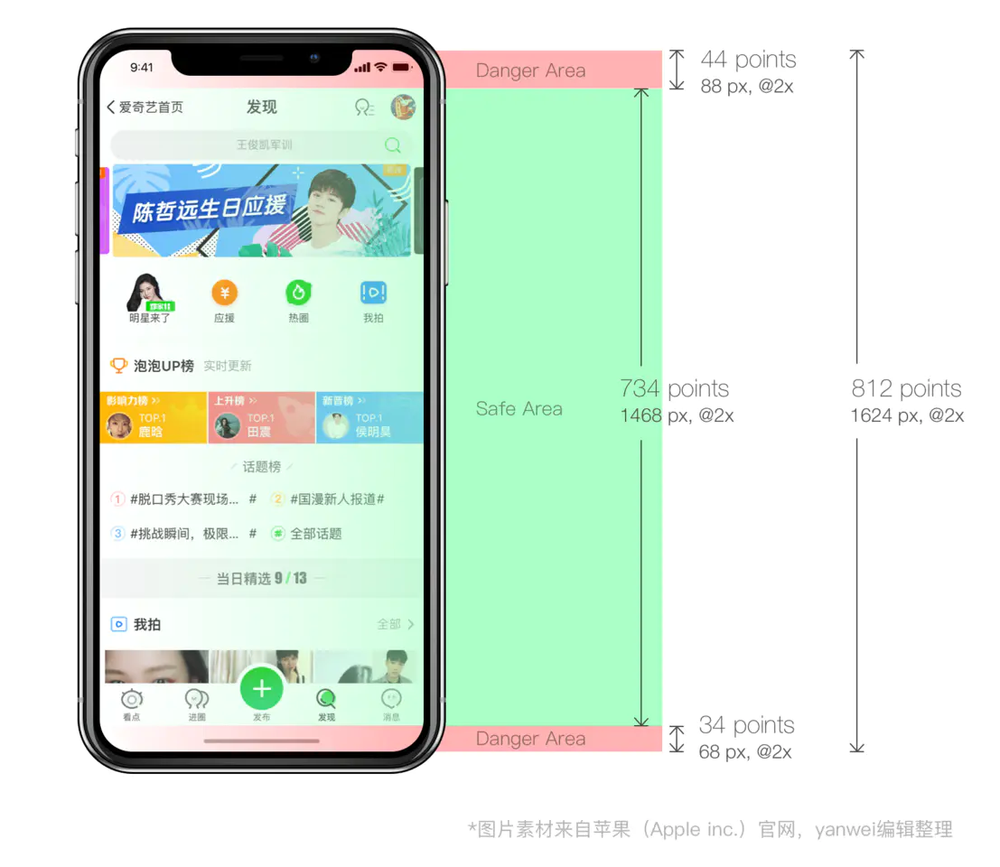

## 插槽slot
自定义组件时slot你不管放在什么位置，渲染时就是都是直接追加在你自定义内容的后面，布局乱掉，位置乱掉。

解决：将下面的图中，微信开发者工具中的设置勾掉即可



<!-- [围观踩坑 go >>](/wechat/taro.html#插槽slot) -->


## pages

```js

{
  "pages": ["pages/index/index", "pages/logs/logs"]
}

```
pages不能单独抽出到一个文件，以下方法不行：

```js
// pages.js
 export const pagesList = ["pages/index/index", "pages/logs/logs"]

 // app.js

 import {pagesList} from './pages.js'

 {
  "pages": pagesList
}
```
## scroll-view 标签

scroll-view 标签对 dispay:flex 无效，so 横向布局一排view时不能用dispay:flex，可采用display: inline-block解决。
```jsx
<scroll-view scroll-x="true" class="scroll-view-demo">
    <view class="item" wx:for="{{[1,2,3,4,5,6,7,8,9,10,11,12,13,14]}}" wx:key="{{index}}">
        {{item}}
    </view>
</scroll-view>

```

```scss

page {
  width: 100%;
  height: 100%;
  background: #17448E;
}
.scroll-view-demo {
  // display: flex;
  // flex-direction: row;
  .item {
    display: inline-block;
    width: 80rpx;
    height: 80rpx;
    margin-right:20rpx;

  }
}
```


## 粘性布局 position:sticky

先看MDN文档：


看一个简单的例子：

<StickyOne/>

::: tip 总结   
* 父元素不能 overflow:hidden、scroll、auto、overlay 属性。
* 父元素的高度不能低于sticky元素的高度
* 父级元素不要设置固定高度（* 效果见上图）
* 必须指定top、bottom、left、right4个值之一，否则只会处于相对定位 （不得不说的废话）
:::

小程序开发时你需要注意：

1. 小程序的page 默认设置了 overflow-x:hidden
```jsx
// error
<page><View className="search-btns"></View></page>

// true：
<page><View><View className="search-btns"></View></View></page>

```

2. 移动端开发有时会为了空元素占位，写height:100vh，需换成min-height:100vh

例如一个职位列表页，当给demo设置height:100vh时，滚动距离大于100vh，sticky元素也会跟着滚走，效果同上图。

```jsx
  <View className="demo">
    <View className="banner"></View>
    <View className="search-btns">搜索定位</View>
    <View className="list">职位列表</View>
    <View className="no-data">暂无数据</View>
  </View>

```


## Taro 爬坑

* 样式推荐使用scss  
  原因：  
  taro-ui自定义主题需要用scss变量覆盖；  
  taro-ui本身样式采用scss ；  
  使用less无法注入全局变量，暂无解决方案；  


## @tarojs/cli 安装、更新失败

```
npm install -g @tarojs/cli
// or
taro update self
```

卸载后重装，还是一直失败  
报错：匹配不到 xxxx 的版本  
原因：cnpm 上的版本未同步  
解决：用 yarn  或者 移除 镜像   


## 父组件传递class给自定义子组件
[外部样式类-全局样式类](https://nervjs.github.io/taro/docs/component-style.html)

```jsx
/* 父 MyPage.js */
export default class MyPage extends Component {
  render () {
    return <CustomComp className="red-text" />
  }
}
/* 子 CustomComp.js */
export default class CustomComp extends Component {
  static defaultProps = {
    className: ''
  }
  render () {
    return <View className={this.props.className}>这段文本的颜色不会由组件外的 class 决定</View>
  }
}
/* MyPage.scss */
.red-text {
  color: red;
}

```
解决：需要利用 externalClasses 定义段定义若干个外部样式类

```jsx
/* 父 */
export default class MyPage extends Component {
  render () {
    return <CustomComp my-class="red-text" />
  }
}
/* 子*/
export default class CustomComp extends Component {
  static externalClasses = ['my-class']
  render () {
    return <View className="my-class">这段文本的颜色由组件外的 class 决定</View>
  }
}

```


## iphonex 底部小黑条

iphoneX机型底部黑色横条会遮挡住底部tabbar



网页版解决：[网页适配 iPhoneX，就是这么简单](https://aotu.io/notes/2017/11/27/iphonex/?utm_source=tuicool&utm_medium=referral)

小程序解决方案：利用 wx.getSystemInfo 方法获取机型，根据机型设置页面class='is-phonex'

1. 入口文件，获取机型信息，将手机型号存储为全局变量
```jsx
// app.jsx
import Taro, { Component } from '@tarojs/taro'
import { setGlobalData } from '@/utils/global'

class App extends Component{
    componentWillMount() {
    wx.getSystemInfo({
      success: function(res) {
        console.log('手机型号：' + res.model)
        if (res.model.includes('iPhone X')) {
          setGlobalData('isIphoneX', true)
        }
      }
    })
  }
}
```
```jsx
// global.js
const globalData = {
  isIphoneX: false
}
export function setGlobalData(key, val) {
  globalData[key] = val
}
export function getGlobalData(key) {
  return globalData[key]
}
```
3、组件高度定义为全局变量
```scss
$iphoneXFoot:68px; // iphoneX底部小黑条
```
4、使用全局变量控制类名
```jsx
// 获取全局变量
const isIphoneX = getGlobalData('isIphoneX')
// 设置class
<View className={`home-index  ${isIphoneX ? 'is-phonex' : ''}`}></View>
```
```scss
// index.scss
.home-index {
    padding: 0 40px 20px;

    &.is-phonex {
        padding: 0 40px 20px + $iphoneXFoot;
    }
}
```


