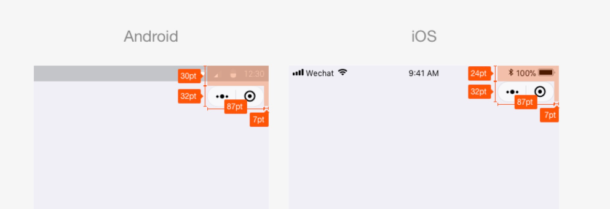
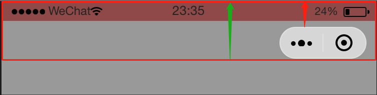

# Taro 爬坑

## Tips

* 样式推荐使用scss  
  原因：  
  taro-ui自定义主题需要用scss变量覆盖；  
  taro-ui本身样式采用scss ；  
  使用less无法注入全局变量，暂无解决方案；  


## 引入iconfont
1. 自行下载 Ionicons 字体图标库
2. 编写字体图标库 css
```css
@font-face {
  font-family: "iconfont";
  ...
}

// 注意：直接下载的iconfont文件包内的class为iconfont
.icon {
  font-family: "iconfont" !important;
  font-size: 16px;
  font-style: normal;
  -webkit-font-smoothing: antialiased;
  -moz-osx-font-smoothing: grayscale;
}

.icon-wangyi:before {
  content: "\e601";
}
```
3. 在 app.js 中全局引入 iconfont.css
4. 更改微信基础库版本
在开发者工具 设置-项目设置-调试基础库 设置版本 2.2.3 以上
5. 使用 AtIcon
```jsx
<AtIcon prefixClass='icon' value='clock' size='30' color='#F00'></AtIcon>
```

## @tarojs/cli 安装、更新失败

```
npm install -g @tarojs/cli
// or
taro update self
```

卸载后重装，还是一直失败  
报错：匹配不到 xxxx 的版本  
原因：cnpm 上的版本未同步  
解决：用 yarn  或者 移除 镜像   
## 插槽slot

自定义组件时slot你不管放在什么位置，渲染时就是都是直接追加在你自定义内容的后面，而且放的位置不一样，虽然都是追加在后面，但是有些样式不生效，布局乱掉，位置乱掉。

代码举例：

```jsx
// children.jsx
<View className='children'>我是一个子组件</View>

 // parent.jsx
<View className='parent' >
    <View className='header'>header</View>
    <View className='content'>
      <children/>
    </View>
</View>
```
小程序渲染结构：
```jsx
// 预期渲染效果
<View className='parent' >
    <View className='header'>header</View>
    <View className='content'>
        <View className='children'>我是一个子组件</View>
    </View>
</View>
// 实际渲染效果
<View className='parent' >
    <View className='header'>header</View>
    <View className='content'></View>
    <View className='children'>我是一个子组件</View>
</View>
```

封装一个tabs组件：
```jsx
// 使用
// index.jsx
<Tabs list={['职位', '团队']} onChange={index => setTab(index)} >
    <TabsPane index={0} current={tab}>
       <Position />
    </TabsPane>
    <TabsPane index={1} current={tab}>
      <Product /> 
    </TabsPane>
</Tabs>
```
```jsx
// tabs.jsx
<view className="tabs">
  <view className="tabs-header">
      这里切换当前tabs，执行onChange
  </view>
  <View className="tabs-body">
    <slot>这里放TabsPane * n </slot>
  </view>
</view>
```

```jsx
// TabsPane.jsx
<View className={`tabs-pane ${index === current ? 'active' : ''}`} >
    {children}
</View>
// scss
.tabs-pane {
    display:block;
    &.active{
        display:none;
    }
}
```

好了，思路清晰，代码很快写好了，美滋滋一看效果，凉凉~~    
小朋友~~ 你是否有许多问号 ~~

你预想的TabsPane结构是这样的：

```jsx
<View className="tabs-pane active" >
    <Position />
</View>
<View className="tabs-pane" >
    <Product /> 
</View>
```
实际渲染结构：

```jsx
<View className="tabs-pane active" ></View>
<Position />
<View className="tabs-pane" ></View>
<Product /> 
```
解决办法：
```scss
// scss
.tabs-pane {
    height: 0;
    overflow: hidden;
    &.active{
        height: auto;
    }
}
```

## 父组件传递class给自定义子组件
【外部样式类】【全局样式类】https://nervjs.github.io/taro/docs/component-style.html

```jsx
/* 父 MyPage.js */
export default class MyPage extends Component {
  render () {
    return <CustomComp className="red-text" />
  }
}
/* 子 CustomComp.js */
export default class CustomComp extends Component {
  static defaultProps = {
    className: ''
  }
  render () {
    return <View className={this.props.className}>这段文本的颜色不会由组件外的 class 决定</View>
  }
}
/* MyPage.scss */
.red-text {
  color: red;
}

```
解决：需要利用 externalClasses 定义段定义若干个外部样式类

```jsx
/* 父 */
export default class MyPage extends Component {
  render () {
    return <CustomComp my-class="red-text" />
  }
}
/* 子*/
export default class CustomComp extends Component {
  static externalClasses = ['my-class']
  render () {
    return <View className="my-class">这段文本的颜色由组件外的 class 决定</View>
  }
}

```


## iphonex 底部小黑条

iphoneX机型底部黑色横条会遮挡住底部tabbar


网页版解决：[网页适配 iPhoneX，就是这么简单](https://aotu.io/notes/2017/11/27/iphonex/?utm_source=tuicool&utm_medium=referral)

小程序解决方案：

1. 入口文件，获取机型信息，将手机型号存储为全局变量
```jsx
// app.jsx
import Taro, { Component } from '@tarojs/taro'
import { setGlobalData } from '@/utils/global'

class App extends Component{
    componentWillMount() {
    wx.getSystemInfo({
      success: function(res) {
        console.log('手机型号：' + res.model)
        if (res.model.includes('iPhone X')) {
          setGlobalData('isIphoneX', true)
        }
      }
    })
  }
}
```
```jsx
// global.js
const globalData = {
  isIphoneX: false
}
export function setGlobalData(key, val) {
  globalData[key] = val
}
export function getGlobalData(key) {
  return globalData[key]
}
```
3、组件高度定义为全局变量
```scss
$tabBarHeight: 100px; // 底部导航高度
$iphoneXFoot:68px; // iphoneX底部小黑条

```
4、使用全局变量控制类名
```jsx
// 获取全局变量
const isIphoneX = getGlobalData('isIphoneX')

// 设置class
<View className={`home-index  ${isIphoneX ? 'is-phonex' : ''}`}></View>

```

```scss
// index.scss
.home-index {
    padding: 0 40px 20px + $tabBarHeight;

    &.is-phonex {
        padding: 0 40px 20px + $tabBarHeight + $iphoneXFoot;
    }
}
```

## 自定义tabBar

原因：
1. app.jsx内作以下配置后，只有首页，职位页会显示tabBar，其他页面无法显示tabBar
2. 【首页】想跳转到【职位】页，只能使用 wx.switchTab，但是URL路径后不能带参数

```js
"tabBar": {
    "list": [
      {
        "pagePath": "pages/index/index",
        "text": "首页"
      },
      {
        "pagePath": "pages/jobs/logs",
        "text": "职位"
      }
    ]
  },
```

封装组件:
```jsx
// Tabber.jsx
import Taro, { useState } from '@tarojs/taro'
import { AtTabBar } from 'taro-ui'
import { getGlobalData } from '@/utils/global'

const isIphoneX = getGlobalData('isIphoneX')

const tabList= [
        { 
          title: '首页', 
          iconPrefixClass: 'icon', 
          iconType: 'shouye', 
          selectedIconType: 'shouye1' 
        },
        { 
          title: '热招职位', 
          iconPrefixClass: 'icon', 
          iconType: 'rezhaozhiwei', 
          selectedIconType: 'rezhaozhiwei1' 
        }
      ]
export default function Tabber(props) {
  const [current, setCurrent] = useState(props.current || 0)
  const handleClick = val => {

    setCurrent(val)
    switch (val) {
      case 0:
        Taro.redirectTo({
          url: `/pages/index/index`
        })
        break
      case 1:
        Taro.redirectTo({
          url: `/pages/jobs/index`
        })
        break
      default:
        break
    }
  }

  return (
    <AtTabBar
      className={isIphoneX ? 'is-phonex' : ''}
      fixed
      tabList={tabList}
      fontSize={12}
      iconSize={18}
      onClick={handleClick}
      current={current}
    />
  )
}


```

```scss
// tabber样式
.at-tab-bar {
    height: $tabBarHeight;

    &.is-phonex {
        padding-bottom: $iphoneXFoot !important;
        background: #FFF !important;
    }
}
```

引用了TabBar的页面，由于底部被TabBar遮挡，需要多加一个底部padding

```scss
// index.scss
.home-index {
    padding-bottom: $tabBarHeight;
}
```

## 自定义顶部导航

可预见的坑：
  * 调皮的胶囊按钮：导航栏元素（文字，图标等）怎么也对不齐那该死的胶囊按钮
  * 机型多如牛毛：自定义导航栏高度在不同机型始终无法达到视觉上的统一
  * 各种尺寸的全面屏，奇怪的刘海屏，简直要抓狂

归根结底，最重要的一点是计算导航栏的高度

老规矩，先扒一波官方文档：



从图中分析，我们可以得到如下信息：

 * Android跟iOS有差异，表现在顶部到胶囊按钮之间的距离差了6pt
 * 胶囊按钮高度为32pt， iOS和Android一致

wait......这仅仅是普通屏幕为参照的，好像并没有提适配的事儿，难道都是一样的？？？    
impossible !!!

我们知道微信有个可以获取机器信息的接口wx.getSystemInfoSync，我们来通过获取信息，看看能不能发现数值：

在 默认导航栏 & 无底部tab栏 的情况下，可以看到三项信息:
 * screenHeight 屏幕高度，单位px
 * windowHeight 可使用窗口高度，单位px
 * statusBarHeight 状态栏的高度，单位px

screenHeight - windowHeight就是默认的导航栏的高度（绿色箭头），statusBarHeight 是状态栏的高度（红色箭头）



但是在设置了"navigationStyle": "custom"之后，screenHeight、 windowHeight二者的值是一样的了，因此导航栏的高度我们需要使用统计的经验值。

```js
{
    'iPhone': 64,
    'iPhoneX': 88,
    'Android': 68,
    'samsung': 72
}
```
方案一：

1. 根据机型设置经验值 navHeight
2. 获取statusBarHeight

方案二：    

 1. Android导航栏高度 =  48px ; iOS导航栏高度 =  44px (多一步计算后你会发现)
 2. 获取statusBarHeight

*注：由于胶囊按钮是原生组件，为表现一直，其单位在个系统都为px，所以我们的自定义导航栏各个高度的单位都必需是px（切记不能用rpx），才能完美适配。

<b>总结：</b>

* 自定义导航组件，结构一分为二：状态栏 + 标题栏
* 状态栏高度通过wx.getSystemInfoSync().statusBarHeight获取
* 标题栏高度：安卓：48px，iOS：44px
* 单位必需跟胶囊按钮一致，用px


选取方案二进行开发：
```jsx
// app.jsx
import { setGlobalData } from '@/utils/global'


 componentWillMount() {
    const systemInfo = Taro.getSystemInfoSync()
      setGlobalData('systemInfo', systemInfo)
  }

```

```jsx
import Taro from '@tarojs/taro'
import { View } from '@tarojs/components'
import { AtIcon } from 'taro-ui'
import { getGlobalData } from '@/utils/global'
import './index.scss'

const NavBar = props => {
  const { back = true, home = false, title } = props
  const systemInfo = getGlobalData('systemInfo')
  const isphone = systemInfo.model.includes('iPhone')
  const statusBarHeight = systemInfo.statusBarHeight
  console.log(systemInfo)
  const navHeight = statusBarHeight + (isphone ? 44 : 48) + 'px'
  const goBack = () => {
    Taro.navigateBack({
      delta: 1
    })
  }
  const goBackHome = () => {}
  return (
    <View className="net-nav-bar">
      <View className="navbar" style={{ height: navHeight }}>
        {/* 状态栏占位块*/}
        <View style={{ height: statusBarHeight + 'PX' }}></View>

        <View className="title-container" style={{ height: navHeight }}>
          <View className="capsule">
            {back && (
              <View onClick={goBack} className="mr-20">
                <AtIcon value="chevron-left" size="26" color="#000" />
              </View>
            )}
            {home && (
              <View onClick={goBackHome}>
                <AtIcon prefixClass="icon" value="shouye" size="25" color="#000" />
              </View>
            )}
          </View>
          <View className="title">{title} </View>
        </View>
      </View>
        {/* 占位块--解决下拉刷新 */}
      <View style={{ height: navHeight, background: '#fff' }}></View>
    </View>
  )
}

export default NavBar


```

```scss
.net-nav-bar {
    background: #fff;

    .mr-20 {
        margin-right: 20px;
    }

    .navbar {
        position: fixed;
        top: 0;
        left: 0;
        z-index: 999;
        display: flex;
        flex-direction: column;
        width: 100%;
    }

    .title-container {
        position: relative;
        display: flex;
        align-items: center;
        justify-content: center;
        height: 100%;
    }

    .capsule {
        position: absolute;
        left: 10px;
        display: flex;
        align-items: center;
    }

    .title {
        font-size: 28px;
    }
}

```
::: tip 
组件内多了一个占位块，是因为某些页面有类似滚动列表或者下拉刷新的需求，要保证导航栏始终在视窗的顶部的话，需要使用定位，定位之后脱离文档流，在最初的时候需要占位块保证后续的页面内容不会被导航栏遮挡。
:::